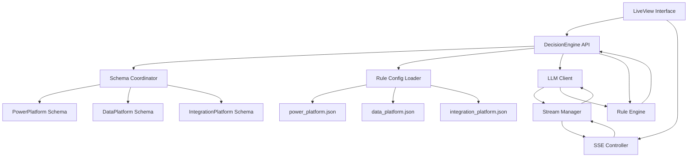

# Design Document

## Overview

The multi-domain decision engine extends the existing single-domain architecture to support multiple specialized decision domains (Power Platform, Data Platform, Integration Platform). The design maintains a clean separation between domain-agnostic core logic and domain-specific configurations, enabling easy addition of new domains without modifying existing code.

The architecture follows a plugin-style approach where each domain provides its own schema module and rule configuration file, while the core engine components (RuleEngine, LLMClient) remain domain-neutral and operate on generic data structures.

## Architecture

The system follows a layered architecture with clear separation of concerns:



### Core Principles

1. **Domain Agnostic Core**: RuleEngine and core LLMClient logic work with generic data structures
2. **Plugin Architecture**: New domains can be added by creating schema modules and configuration files
3. **Configuration-Driven**: Domain behavior is controlled through JSON configuration files
4. **Type Safety**: Domain types are defined centrally for compile-time validation
5. **Backward Compatibility**: Existing API maintains compatibility with sensible defaults

## Components and Interfaces

### DecisionEngine.Types

Central type definitions for domain management:

```elixir
defmodule DecisionEngine.Types do
  @type domain :: :power_platform | :data_platform | :integration_platform
  
  @type rule_config :: %{
    "domain" => String.t(),
    "signals_fields" => [String.t()],
    "patterns" => [pattern()]
  }
  
  @type pattern :: %{
    "id" => String.t(),
    "outcome" => String.t(),
    "score" => float(),
    "summary" => String.t(),
    "use_when" => [condition()],
    "avoid_when" => [condition()],
    "typical_use_cases" => [String.t()]
  }
  
  @type condition :: %{
    "field" => String.t(),
    "op" => String.t(),
    "value" => term()
  }
end
```

### DecisionEngine.SignalsSchema

Domain schema coordinator that maps domains to their specific schema modules:

```elixir
defmodule DecisionEngine.SignalsSchema do
  alias DecisionEngine.Types
  
  @spec module_for(Types.domain()) :: module()
  def module_for(:power_platform), do: DecisionEngine.SignalsSchema.PowerPlatform
  def module_for(:data_platform), do: DecisionEngine.SignalsSchema.DataPlatform
  def module_for(:integration_platform), do: DecisionEngine.SignalsSchema.IntegrationPlatform
end
```

Each domain schema module implements a consistent interface:

```elixir
defmodule DecisionEngine.SignalsSchema.PowerPlatform do
  @behaviour DecisionEngine.SignalsSchema.Behaviour
  
  @schema %{
    "type" => "object",
    "properties" => %{
      "workload_type" => %{
        "type" => "string",
        "enum" => ["user_productivity", "event_driven_business_process", "data_pipeline"]
      },
      # ... other fields
    }
  }
  
  def schema, do: @schema
  def apply_defaults(signals), do: # domain-specific defaults
end
```

### DecisionEngine.RuleConfig

Configuration loader that handles domain-specific rule files:

```elixir
defmodule DecisionEngine.RuleConfig do
  alias DecisionEngine.Types
  
  @spec load(Types.domain()) :: {:ok, Types.rule_config()} | {:error, term()}
  def load(domain) do
    path = "priv/rules/#{domain}.json"
    
    with {:ok, content} <- File.read(path),
         {:ok, config} <- Jason.decode(content),
         :ok <- validate_config(config) do
      {:ok, config}
    end
  end
  
  defp validate_config(config) do
    # Validate required fields and structure
  end
end
```

### DecisionEngine.RuleEngine (Enhanced)

The rule engine remains domain-agnostic but now operates on configuration-driven patterns:

```elixir
defmodule DecisionEngine.RuleEngine do
  alias DecisionEngine.Types
  
  @spec evaluate(map(), Types.rule_config()) :: map()
  def evaluate(signals, rule_config) do
    patterns = rule_config["patterns"]
    
    patterns_with_scores = 
      patterns
      |> Enum.map(&evaluate_pattern(&1, signals))
      |> Enum.sort_by(fn {_pattern, match, score, _avoid_score} -> 
        {match, score} 
      end, :desc)
    
    determine_recommendation(patterns_with_scores)
  end
  
  defp evaluate_pattern(pattern, signals) do
    use_when_score = evaluate_conditions(pattern["use_when"], signals)
    avoid_when_score = evaluate_conditions(pattern["avoid_when"], signals)
    match = use_when_score == 1.0 and avoid_when_score == 0.0
    
    {pattern, match, use_when_score, avoid_when_score}
  end
  
  defp evaluate_conditions(conditions, signals) do
    # Generic condition evaluation supporting in, intersects, not_intersects
  end
end
```

### DecisionEngine.LLMClient (Enhanced)

Enhanced to support domain-aware prompt generation, markdown-formatted responses, and streaming capabilities:

```elixir
defmodule DecisionEngine.LLMClient do
  alias DecisionEngine.Types
  
  @spec extract_signals(String.t(), map(), Types.domain(), module(), Types.rule_config(), non_neg_integer()) ::
    {:ok, map()} | {:error, term()}
  def extract_signals(scenario, config, domain, schema_module, rule_config, retry_count \\ 0) do
    prompt = build_extraction_prompt(scenario, domain, schema_module, rule_config, retry_count)
    
    with {:ok, response} <- call_llm(prompt, config),
         {:ok, signals} <- parse_and_validate_signals(response, schema_module, domain, retry_count) do
      {:ok, signals}
    end
  end
  
  @spec generate_justification(map(), map(), map(), Types.domain()) :: {:ok, String.t()} | {:error, term()}
  def generate_justification(signals, decision_result, config, domain) do
    prompt = build_justification_prompt(signals, decision_result, domain)
    
    with {:ok, response} <- call_llm(prompt, config) do
      # Response is expected to be markdown-formatted
      {:ok, response}
    end
  end
  
  @spec stream_justification(map(), map(), map(), Types.domain(), pid()) :: :ok | {:error, term()}
  def stream_justification(signals, decision_result, config, domain, stream_pid) do
    prompt = build_justification_prompt(signals, decision_result, domain)
    
    # Configure LLM for streaming mode
    streaming_config = Map.put(config, :stream, true)
    
    case call_llm_stream(prompt, streaming_config, stream_pid) do
      :ok -> :ok
      {:error, reason} -> {:error, reason}
    end
  end
  
  defp call_llm_stream(prompt, config, stream_pid) do
    # Implementation will depend on LLM provider
    # Send chunks to stream_pid as they arrive
    # Each chunk should be sent as {:chunk, content}
    # Final message should be {:complete}
  end
  
  defp build_extraction_prompt(scenario, domain, schema_module, rule_config, retry_count) do
    schema = schema_module.schema()
    patterns = rule_config["patterns"]
    
    # Build domain-aware prompt including:
    # - Domain context
    # - Available signal fields and enums
    # - Pattern summaries for context
    # - Instructions to align with appropriate patterns
  end
  
  defp build_justification_prompt(signals, decision_result, domain) do
    # Build prompt that instructs LLM to format response as markdown
    # Include instructions for using headers, lists, emphasis for structure
  end
end
```

### DecisionEngine.StreamManager

New component for managing SSE streams and coordinating with LLM client:

```elixir
defmodule DecisionEngine.StreamManager do
  use GenServer
  alias DecisionEngine.{LLMClient, MarkdownRenderer}
  
  @moduledoc """
  Manages Server-Sent Event streams for real-time LLM response delivery.
  Coordinates between LLM client streaming and SSE connections.
  """
  
  defstruct [:session_id, :sse_pid, :accumulated_content, :status]
  
  def start_link(session_id, sse_pid) do
    GenServer.start_link(__MODULE__, {session_id, sse_pid}, name: via_tuple(session_id))
  end
  
  @spec stream_processing(String.t(), map(), map(), map(), atom()) :: :ok | {:error, term()}
  def stream_processing(session_id, signals, decision_result, config, domain) do
    case GenServer.whereis(via_tuple(session_id)) do
      nil -> {:error, :stream_not_found}
      pid -> GenServer.cast(pid, {:start_streaming, signals, decision_result, config, domain})
    end
  end
  
  def handle_cast({:start_streaming, signals, decision_result, config, domain}, state) do
    # Send initial processing event
    send_sse_event(state.sse_pid, "processing_started", %{domain: domain})
    
    # Start LLM streaming
    case LLMClient.stream_justification(signals, decision_result, config, domain, self()) do
      :ok -> {:noreply, %{state | status: :streaming}}
      {:error, reason} -> 
        send_sse_event(state.sse_pid, "error", %{reason: reason})
        {:noreply, %{state | status: :error}}
    end
  end
  
  def handle_info({:chunk, content}, state) do
    # Accumulate content and render markdown progressively
    new_content = state.accumulated_content <> content
    rendered_html = MarkdownRenderer.render_to_html!(new_content)
    
    # Send chunk to SSE client
    send_sse_event(state.sse_pid, "content_chunk", %{
      content: content,
      rendered_html: rendered_html,
      accumulated_content: new_content
    })
    
    {:noreply, %{state | accumulated_content: new_content}}
  end
  
  def handle_info({:complete}, state) do
    # Send completion event
    send_sse_event(state.sse_pid, "processing_complete", %{
      final_content: state.accumulated_content,
      final_html: MarkdownRenderer.render_to_html!(state.accumulated_content)
    })
    
    {:stop, :normal, state}
  end
  
  defp send_sse_event(sse_pid, event_type, data) do
    send(sse_pid, {:sse_event, event_type, data})
  end
  
  defp via_tuple(session_id) do
    {:via, Registry, {DecisionEngine.StreamRegistry, session_id}}
  end
end
```

### DecisionEngine.MarkdownRenderer

New component for safely rendering markdown content:

```elixir
defmodule DecisionEngine.MarkdownRenderer do
  @moduledoc """
  Handles conversion of markdown text to safe HTML for display in the interface.
  Provides XSS protection while preserving formatting elements.
  """
  
  @spec render_to_html(String.t()) :: {:ok, String.t()} | {:error, term()}
  def render_to_html(markdown_content) do
    try do
      html = 
        markdown_content
        |> Earmark.as_html!()
        |> sanitize_html()
      
      {:ok, html}
    rescue
      error ->
        # Graceful fallback to raw text
        {:error, error}
    end
  end
  
  @spec render_to_html!(String.t()) :: String.t()
  def render_to_html!(markdown_content) do
    case render_to_html(markdown_content) do
      {:ok, html} -> html
      {:error, _} -> escape_html(markdown_content)
    end
  end
  
  defp sanitize_html(html) do
    # Use HtmlSanitizeEx to remove dangerous elements while preserving formatting
    HtmlSanitizeEx.markdown_html(html)
  end
  
  defp escape_html(text) do
    Phoenix.HTML.html_escape(text) |> Phoenix.HTML.safe_to_string()
  end
end
```

### DecisionEngine API (Enhanced)

Updated main API to support domain selection, markdown rendering, and streaming:

```elixir
defmodule DecisionEngine do
  alias DecisionEngine.Types
  alias DecisionEngine.{MarkdownRenderer, StreamManager}
  
  @spec process(String.t(), Types.domain(), map()) :: {:ok, map()} | {:error, term()}
  def process(scenario, domain, config) do
    with {:ok, rule_config} <- DecisionEngine.RuleConfig.load(domain),
         schema_module <- DecisionEngine.SignalsSchema.module_for(domain),
         {:ok, signals} <- DecisionEngine.LLMClient.extract_signals(
           scenario, config, domain, schema_module, rule_config
         ),
         decision_result <- DecisionEngine.RuleEngine.evaluate(signals, rule_config),
         {:ok, raw_justification} <- DecisionEngine.LLMClient.generate_justification(
           signals, decision_result, config, domain
         ) do
      
      # Render markdown justification to HTML
      rendered_html = MarkdownRenderer.render_to_html!(raw_justification)
      
      result = %{
        domain: domain,
        signals: signals,
        decision: decision_result,
        justification: %{
          raw_markdown: raw_justification,
          rendered_html: rendered_html
        },
        timestamp: DateTime.utc_now()
      }
      
      {:ok, result}
    end
  end
  
  @spec process_streaming(String.t(), Types.domain(), map(), String.t()) :: {:ok, map()} | {:error, term()}
  def process_streaming(scenario, domain, config, session_id) do
    with {:ok, rule_config} <- DecisionEngine.RuleConfig.load(domain),
         schema_module <- DecisionEngine.SignalsSchema.module_for(domain),
         {:ok, signals} <- DecisionEngine.LLMClient.extract_signals(
           scenario, config, domain, schema_module, rule_config
         ),
         decision_result <- DecisionEngine.RuleEngine.evaluate(signals, rule_config) do
      
      # Start streaming justification generation
      case StreamManager.stream_processing(session_id, signals, decision_result, config, domain) do
        :ok -> 
          {:ok, %{
            domain: domain,
            signals: signals,
            decision: decision_result,
            streaming: true,
            session_id: session_id,
            timestamp: DateTime.utc_now()
          }}
        {:error, reason} -> {:error, reason}
      end
    end
  end
  
  # Backward compatibility
  def process(scenario, config) do
    process(scenario, :power_platform, config)
  end
end
```

### DecisionEngineWeb.SSEController

New Phoenix controller for handling Server-Sent Events:

```elixir
defmodule DecisionEngineWeb.SSEController do
  use DecisionEngineWeb, :controller
  alias DecisionEngine.StreamManager
  
  def stream(conn, %{"session_id" => session_id}) do
    conn = 
      conn
      |> put_resp_header("content-type", "text/event-stream")
      |> put_resp_header("cache-control", "no-cache")
      |> put_resp_header("connection", "keep-alive")
      |> put_resp_header("access-control-allow-origin", "*")
      |> send_chunked(200)
    
    # Start stream manager for this session
    {:ok, _pid} = StreamManager.start_link(session_id, self())
    
    # Keep connection alive and handle SSE events
    handle_sse_loop(conn)
  end
  
  defp handle_sse_loop(conn) do
    receive do
      {:sse_event, event_type, data} ->
        case send_sse_event(conn, event_type, data) do
          {:ok, conn} -> handle_sse_loop(conn)
          {:error, _} -> conn
        end
      
      {:EXIT, _pid, _reason} ->
        conn
        
    after
      30_000 -> # 30 second timeout
        send_sse_event(conn, "timeout", %{message: "Connection timeout"})
        conn
    end
  end
  
  defp send_sse_event(conn, event_type, data) do
    json_data = Jason.encode!(data)
    sse_data = "event: #{event_type}\ndata: #{json_data}\n\n"
    
    chunk(conn, sse_data)
  end
end
```

### Domain Card Decision Table Component

The domain management interface features enhanced domain cards with expandable decision tables that provide users with a quick visual overview of how each domain's decision patterns work.

**Decision Table Features:**
- **Pattern Overview**: Shows top 5 patterns for each domain with their outcomes and confidence scores
- **Condition Visualization**: Displays key use_when and avoid_when conditions in a readable format
- **Interactive Expansion**: Click to expand/collapse detailed pattern information
- **Visual Indicators**: Color-coded conditions (green for use_when, red for avoid_when)
- **Responsive Design**: Adapts to different screen sizes while maintaining readability

**Decision Table Structure:**
```
Domain Card
├── Domain Header (Name, Description)
├── Quick Stats (# Patterns, # Signal Fields)
├── Decision Table (Expandable)
│   ├── Pattern Row 1: [Outcome] [Score] [Key Conditions]
│   ├── Pattern Row 2: [Outcome] [Score] [Key Conditions]
│   └── ... (up to 5 patterns)
└── Action Buttons (Edit, Delete)
```

**Condition Display Format:**
- Use When: `field_name IN [value1, value2]` (green indicator)
- Avoid When: `field_name NOT_IN [value]` (red indicator)
- Truncated values for long lists with "+N more" indicator

### DecisionEngine.DomainManager

New component for managing domain configurations through the LiveView interface:

```elixir
defmodule DecisionEngine.DomainManager do
  @moduledoc """
  Manages domain configurations including CRUD operations for domains.
  Handles persistence to configuration files and dynamic reloading.
  """
  
  alias DecisionEngine.Types
  alias DecisionEngine.RuleConfig
  
  @type domain_config :: %{
    name: String.t(),
    display_name: String.t(),
    description: String.t(),
    signals_fields: [String.t()],
    patterns: [Types.pattern()],
    schema_module: String.t()
  }
  
  @spec list_domains() :: {:ok, [domain_config()]} | {:error, term()}
  def list_domains do
    case File.ls("priv/rules") do
      {:ok, files} ->
        domains = 
          files
          |> Enum.filter(&String.ends_with?(&1, ".json"))
          |> Enum.map(&Path.rootname/1)
          |> Enum.map(&String.to_atom/1)
          |> Enum.map(&load_domain_config/1)
          |> Enum.filter(fn
            {:ok, _} -> true
            {:error, _} -> false
          end)
          |> Enum.map(fn {:ok, config} -> config end)
        
        {:ok, domains}
      
      {:error, reason} -> {:error, reason}
    end
  end
  
  @spec get_domain(Types.domain()) :: {:ok, domain_config()} | {:error, term()}
  def get_domain(domain) do
    load_domain_config(domain)
  end
  
  @spec create_domain(domain_config()) :: {:ok, domain_config()} | {:error, term()}
  def create_domain(domain_config) do
    domain_atom = String.to_atom(domain_config.name)
    
    # Check if domain already exists
    case get_domain(domain_atom) do
      {:ok, _} -> {:error, :domain_already_exists}
      {:error, :enoent} ->
        # Create configuration file
        config_data = %{
          "domain" => domain_config.name,
          "display_name" => domain_config.display_name,
          "description" => domain_config.description,
          "signals_fields" => domain_config.signals_fields,
          "patterns" => domain_config.patterns,
          "schema_module" => domain_config.schema_module
        }
        
        case save_domain_config(domain_atom, config_data) do
          :ok -> 
            # Invalidate cache and reload
            RuleConfig.invalidate_cache(domain_atom)
            {:ok, domain_config}
          {:error, reason} -> {:error, reason}
        end
      
      {:error, reason} -> {:error, reason}
    end
  end
  
  @spec update_domain(Types.domain(), domain_config()) :: {:ok, domain_config()} | {:error, term()}
  def update_domain(domain, domain_config) do
    # Verify domain exists
    case get_domain(domain) do
      {:ok, _existing} ->
        config_data = %{
          "domain" => domain_config.name,
          "display_name" => domain_config.display_name,
          "description" => domain_config.description,
          "signals_fields" => domain_config.signals_fields,
          "patterns" => domain_config.patterns,
          "schema_module" => domain_config.schema_module
        }
        
        case save_domain_config(domain, config_data) do
          :ok -> 
            # Invalidate cache and reload
            RuleConfig.invalidate_cache(domain)
            {:ok, domain_config}
          {:error, reason} -> {:error, reason}
        end
      
      {:error, reason} -> {:error, reason}
    end
  end
  
  @spec delete_domain(Types.domain()) :: :ok | {:error, term()}
  def delete_domain(domain) do
    path = "priv/rules/#{domain}.json"
    
    case File.rm(path) do
      :ok -> 
        # Invalidate cache
        RuleConfig.invalidate_cache(domain)
        :ok
      {:error, reason} -> {:error, reason}
    end
  end
  
  @spec validate_domain_config(domain_config()) :: :ok | {:error, [String.t()]}
  def validate_domain_config(domain_config) do
    errors = []
    
    errors = if String.trim(domain_config.name) == "", do: ["Domain name cannot be empty" | errors], else: errors
    errors = if String.trim(domain_config.display_name) == "", do: ["Display name cannot be empty" | errors], else: errors
    errors = if length(domain_config.signals_fields) == 0, do: ["At least one signal field is required" | errors], else: errors
    
    # Validate patterns
    pattern_errors = 
      domain_config.patterns
      |> Enum.with_index()
      |> Enum.flat_map(fn {pattern, index} ->
        validate_pattern(pattern, index)
      end)
    
    errors = errors ++ pattern_errors
    
    case errors do
      [] -> :ok
      _ -> {:error, errors}
    end
  end
  
  defp validate_pattern(pattern, index) do
    errors = []
    
    errors = if not Map.has_key?(pattern, "id") or String.trim(pattern["id"]) == "", 
      do: ["Pattern #{index + 1}: ID is required" | errors], else: errors
    
    errors = if not Map.has_key?(pattern, "outcome") or String.trim(pattern["outcome"]) == "", 
      do: ["Pattern #{index + 1}: Outcome is required" | errors], else: errors
    
    errors = if not Map.has_key?(pattern, "score") or not is_number(pattern["score"]), 
      do: ["Pattern #{index + 1}: Score must be a number" | errors], else: errors
    
    errors = if not Map.has_key?(pattern, "summary") or String.trim(pattern["summary"]) == "", 
      do: ["Pattern #{index + 1}: Summary is required" | errors], else: errors
    
    errors
  end
  
  defp load_domain_config(domain) do
    case RuleConfig.load(domain) do
      {:ok, config} ->
        domain_config = %{
          name: config["domain"],
          display_name: config["display_name"] || String.replace(to_string(domain), "_", " ") |> String.capitalize(),
          description: config["description"] || "No description provided",
          signals_fields: config["signals_fields"],
          patterns: config["patterns"],
          schema_module: config["schema_module"] || "DecisionEngine.SignalsSchema.#{Macro.camelize(to_string(domain))}"
        }
        {:ok, domain_config}
      
      {:error, reason} -> {:error, reason}
    end
  end
  
  defp save_domain_config(domain, config_data) do
    path = "priv/rules/#{domain}.json"
    
    case Jason.encode(config_data, pretty: true) do
      {:ok, json} ->
        File.write(path, json)
      {:error, reason} -> {:error, reason}
    end
  end
end
```

### DecisionEngineWeb.DomainManagementLive

New LiveView for domain management interface with enhanced domain cards featuring decision tables:

```elixir
defmodule DecisionEngineWeb.DomainManagementLive do
  use DecisionEngineWeb, :live_view
  alias DecisionEngine.DomainManager
  alias DecisionEngine.Types
  
  @impl true
  def mount(_params, _session, socket) do
    {:ok, domains} = DomainManager.list_domains()
    
    socket = 
      socket
      |> assign(:domains, domains)
      |> assign(:selected_domain, nil)
      |> assign(:form_mode, :list)
      |> assign(:form_data, %{})
      |> assign(:errors, [])
      |> assign(:expanded_domain, nil)
    
    {:ok, socket}
  end
  
  @impl true
  def handle_event("new_domain", _params, socket) do
    form_data = %{
      name: "",
      display_name: "",
      description: "",
      signals_fields: [""],
      patterns: [default_pattern()],
      schema_module: ""
    }
    
    socket = 
      socket
      |> assign(:form_mode, :new)
      |> assign(:form_data, form_data)
      |> assign(:errors, [])
    
    {:noreply, socket}
  end
  
  @impl true
  def handle_event("edit_domain", %{"domain" => domain_name}, socket) do
    domain_atom = String.to_atom(domain_name)
    
    case DomainManager.get_domain(domain_atom) do
      {:ok, domain_config} ->
        socket = 
          socket
          |> assign(:form_mode, :edit)
          |> assign(:selected_domain, domain_atom)
          |> assign(:form_data, domain_config)
          |> assign(:errors, [])
        
        {:noreply, socket}
      
      {:error, _reason} ->
        {:noreply, put_flash(socket, :error, "Failed to load domain configuration")}
    end
  end
  
  @impl true
  def handle_event("delete_domain", %{"domain" => domain_name}, socket) do
    domain_atom = String.to_atom(domain_name)
    
    case DomainManager.delete_domain(domain_atom) do
      :ok ->
        {:ok, domains} = DomainManager.list_domains()
        
        socket = 
          socket
          |> assign(:domains, domains)
          |> assign(:form_mode, :list)
          |> put_flash(:info, "Domain deleted successfully")
        
        {:noreply, socket}
      
      {:error, _reason} ->
        {:noreply, put_flash(socket, :error, "Failed to delete domain")}
    end
  end
  
  @impl true
  def handle_event("save_domain", %{"domain" => domain_params}, socket) do
    domain_config = %{
      name: domain_params["name"],
      display_name: domain_params["display_name"],
      description: domain_params["description"],
      signals_fields: parse_signals_fields(domain_params["signals_fields"]),
      patterns: parse_patterns(domain_params["patterns"]),
      schema_module: domain_params["schema_module"]
    }
    
    case DomainManager.validate_domain_config(domain_config) do
      :ok ->
        result = case socket.assigns.form_mode do
          :new -> DomainManager.create_domain(domain_config)
          :edit -> DomainManager.update_domain(socket.assigns.selected_domain, domain_config)
        end
        
        case result do
          {:ok, _} ->
            {:ok, domains} = DomainManager.list_domains()
            
            socket = 
              socket
              |> assign(:domains, domains)
              |> assign(:form_mode, :list)
              |> assign(:errors, [])
              |> put_flash(:info, "Domain saved successfully")
            
            {:noreply, socket}
          
          {:error, :domain_already_exists} ->
            {:noreply, assign(socket, :errors, ["Domain name already exists"])}
          
          {:error, _reason} ->
            {:noreply, assign(socket, :errors, ["Failed to save domain configuration"])}
        end
      
      {:error, errors} ->
        {:noreply, assign(socket, :errors, errors)}
    end
  end
  
  @impl true
  def handle_event("cancel", _params, socket) do
    socket = 
      socket
      |> assign(:form_mode, :list)
      |> assign(:errors, [])
    
    {:noreply, socket}
  end
  
  @impl true
  def handle_event("toggle_domain_details", %{"domain" => domain_name}, socket) do
    domain_atom = String.to_atom(domain_name)
    
    expanded_domain = case socket.assigns.expanded_domain do
      ^domain_atom -> nil  # Collapse if already expanded
      _ -> domain_atom     # Expand this domain
    end
    
    {:noreply, assign(socket, :expanded_domain, expanded_domain)}
  end
  
  @impl true
  def handle_event("add_signal_field", _params, socket) do
    form_data = socket.assigns.form_data
    updated_fields = form_data.signals_fields ++ [""]
    updated_form_data = %{form_data | signals_fields: updated_fields}
    
    {:noreply, assign(socket, :form_data, updated_form_data)}
  end
  
  @impl true
  def handle_event("remove_signal_field", %{"index" => index_str}, socket) do
    index = String.to_integer(index_str)
    form_data = socket.assigns.form_data
    updated_fields = List.delete_at(form_data.signals_fields, index)
    updated_form_data = %{form_data | signals_fields: updated_fields}
    
    {:noreply, assign(socket, :form_data, updated_form_data)}
  end
  
  @impl true
  def handle_event("add_pattern", _params, socket) do
    form_data = socket.assigns.form_data
    updated_patterns = form_data.patterns ++ [default_pattern()]
    updated_form_data = %{form_data | patterns: updated_patterns}
    
    {:noreply, assign(socket, :form_data, updated_form_data)}
  end
  
  @impl true
  def handle_event("remove_pattern", %{"index" => index_str}, socket) do
    index = String.to_integer(index_str)
    form_data = socket.assigns.form_data
    updated_patterns = List.delete_at(form_data.patterns, index)
    updated_form_data = %{form_data | patterns: updated_patterns}
    
    {:noreply, assign(socket, :form_data, updated_form_data)}
  end
  
  defp default_pattern do
    %{
      "id" => "",
      "outcome" => "",
      "score" => 0.5,
      "summary" => "",
      "use_when" => [],
      "avoid_when" => [],
      "typical_use_cases" => []
    }
  end
  
  defp parse_signals_fields(fields_string) when is_binary(fields_string) do
    fields_string
    |> String.split(",")
    |> Enum.map(&String.trim/1)
    |> Enum.reject(&(&1 == ""))
  end
  
  defp parse_signals_fields(fields_list) when is_list(fields_list) do
    fields_list
    |> Enum.map(&String.trim/1)
    |> Enum.reject(&(&1 == ""))
  end
  
  defp parse_patterns(patterns_data) do
    # Implementation depends on form structure
    # This would parse the complex pattern form data
    patterns_data
  end
  
  # Helper function to generate decision table data for domain cards
  def generate_decision_table(domain_config) do
    patterns = domain_config.patterns
    signal_fields = domain_config.signals_fields
    
    # Create a simplified decision matrix showing key patterns and their conditions
    patterns
    |> Enum.take(5)  # Limit to top 5 patterns for card display
    |> Enum.map(fn pattern ->
      %{
        id: pattern["id"],
        outcome: pattern["outcome"],
        score: pattern["score"],
        summary: String.slice(pattern["summary"], 0, 60) <> "...",
        key_conditions: extract_key_conditions(pattern, signal_fields)
      }
    end)
  end
  
  defp extract_key_conditions(pattern, signal_fields) do
    use_when = pattern["use_when"] || []
    avoid_when = pattern["avoid_when"] || []
    
    # Extract the most important conditions for display
    key_use_conditions = 
      use_when
      |> Enum.take(2)  # Show top 2 use_when conditions
      |> Enum.map(fn condition ->
        %{
          field: condition["field"],
          operator: condition["op"],
          value: format_condition_value(condition["value"]),
          type: :use_when
        }
      end)
    
    key_avoid_conditions = 
      avoid_when
      |> Enum.take(1)  # Show top 1 avoid_when condition
      |> Enum.map(fn condition ->
        %{
          field: condition["field"],
          operator: condition["op"],
          value: format_condition_value(condition["value"]),
          type: :avoid_when
        }
      end)
    
    key_use_conditions ++ key_avoid_conditions
  end
  
  defp format_condition_value(value) when is_list(value) do
    case length(value) do
      1 -> hd(value)
      n when n <= 3 -> Enum.join(value, ", ")
      _ -> "#{hd(value)}, ... (+#{length(value) - 1} more)"
    end
  end
  
  defp format_condition_value(value), do: to_string(value)
end
```

## Data Models

### Domain Configuration Structure

Each domain configuration file follows this JSON schema:

```json
{
  "domain": "power_platform",
  "signals_fields": [
    "workload_type",
    "primary_users",
    "trigger_nature"
  ],
  "patterns": [
    {
      "id": "power_automate_good_fit",
      "outcome": "prefer_power_automate",
      "score": 0.9,
      "summary": "Use Power Automate as the primary automation platform",
      "use_when": [
        {"field": "workload_type", "op": "in", "value": ["user_productivity"]},
        {"field": "primary_users", "op": "intersects", "value": ["business_users"]}
      ],
      "avoid_when": [
        {"field": "availability_requirement", "op": "in", "value": ["mission_critical"]}
      ],
      "typical_use_cases": [
        "Approval workflows on SharePoint",
        "Notification flows based on M365 events"
      ]
    }
  ]
}
```

### Signal Schema Structure

Each domain schema module provides a JSON Schema definition:

```elixir
@schema %{
  "type" => "object",
  "properties" => %{
    "workload_type" => %{
      "type" => "string",
      "enum" => ["user_productivity", "event_driven_business_process", "data_pipeline"],
      "description" => "Primary type of workload being automated"
    },
    "primary_users" => %{
      "type" => "array",
      "items" => %{
        "type" => "string",
        "enum" => ["citizen_developers", "business_users", "it_professionals"]
      },
      "description" => "Main user groups who will interact with the solution"
    }
  },
  "required" => ["workload_type", "primary_users"]
}
```

### Decision Result Structure

Enhanced to include domain information and markdown-formatted content:

```elixir
%{
  domain: :power_platform,
  signals: %{
    "workload_type" => "user_productivity",
    "primary_users" => ["business_users"]
  },
  decision: %{
    recommendation: "prefer_power_automate",
    confidence: 0.9,
    matched_patterns: ["power_automate_good_fit"],
    reasoning: "Strong alignment with business user workflows"
  },
  justification: %{
    raw_markdown: "## Recommendation: Power Automate\n\nBased on the user productivity focus and business user audience:\n\n- **Primary Users**: Business users who need intuitive interfaces\n- **Workload Type**: User productivity workflows\n\n### Key Benefits\n1. Low-code approach suitable for citizen developers\n2. Native integration with M365 ecosystem",
    rendered_html: "<h2>Recommendation: Power Automate</h2><p>Based on the user productivity focus and business user audience:</p><ul><li><strong>Primary Users</strong>: Business users who need intuitive interfaces</li><li><strong>Workload Type</strong>: User productivity workflows</li></ul><h3>Key Benefits</h3><ol><li>Low-code approach suitable for citizen developers</li><li>Native integration with M365 ecosystem</li></ol>"
  },
  timestamp: ~U[2024-12-12 10:30:00Z]
}
```

## Correctness Properties

*A property is a characteristic or behavior that should hold true across all valid executions of a system-essentially, a formal statement about what the system should do. Properties serve as the bridge between human-readable specifications and machine-verifiable correctness guarantees.*

### Property 1: Domain Support Completeness
*For any* defined domain type (power_platform, data_platform, integration_platform), the system should successfully initialize and process scenarios without errors
**Validates: Requirements 1.1**

### Property 2: Domain Configuration Loading
*For any* valid domain, requesting that domain should successfully load the corresponding rule configuration and signal schema without errors
**Validates: Requirements 1.3, 2.1, 2.2**

### Property 3: Domain Processing Isolation
*For any* scenario processed with different domains, the system should use domain-specific rules and schemas, producing domain-appropriate results
**Validates: Requirements 1.4**

### Property 4: Domain Extensibility
*For any* new domain added to the system (with proper configuration and schema), the system should process scenarios for that domain without requiring modifications to core engine logic
**Validates: Requirements 1.5, 3.4**

### Property 5: Configuration Structure Validation
*For any* domain configuration file, all patterns should contain the required fields: id, outcome, score, summary, use_when, avoid_when, and typical_use_cases
**Validates: Requirements 2.3**

### Property 6: Operator Support Consistency
*For any* domain and any condition using operators (in, intersects, not_intersects), the evaluation should work correctly regardless of the domain context
**Validates: Requirements 2.4**

### Property 7: Schema Module Mapping
*For any* valid domain, the SignalsSchema should return the correct schema module specific to that domain
**Validates: Requirements 3.1**

### Property 8: Domain-Specific Signal Extraction
*For any* domain, signal extraction should respect that domain's field definitions and enumerated values
**Validates: Requirements 3.2, 3.3**

### Property 9: Domain Schema Isolation
*For any* changes made to one domain's schema, other domains should remain completely unaffected
**Validates: Requirements 3.5**

### Property 10: LLM Client Domain Context
*For any* signal extraction request, the LLM client should receive and use domain context, schema module, and rule configuration
**Validates: Requirements 4.1**

### Property 11: Domain-Aware Prompt Generation
*For any* domain, extraction prompts should include domain-specific field descriptions and pattern summaries
**Validates: Requirements 4.2, 4.3**

### Property 12: API Domain Parameter Handling
*For any* scenario processing request with a domain parameter, the DecisionEngine should use that domain for loading configurations and processing
**Validates: Requirements 5.1, 5.2**

### Property 13: Domain Information in Results
*For any* processing result, the response should include the domain that was used for processing
**Validates: Requirements 5.3**

### Property 14: Backward Compatibility Preservation
*For any* existing API call without domain specification, the system should process using a sensible default domain
**Validates: Requirements 5.5**

### Property 15: UI Domain State Consistency
*For any* domain selection change in the interface, subsequent processing should use the newly selected domain
**Validates: Requirements 6.2, 6.3**

### Property 16: Rule Engine Domain Agnosticism
*For any* valid signals and rule_config combination, the RuleEngine should process them consistently regardless of which domain they came from
**Validates: Requirements 7.1, 7.2, 7.3, 7.4**

### Property 17: Configuration File Naming Convention
*For any* domain, the RuleConfig should load configuration files using the pattern "priv/rules/{domain}.json"
**Validates: Requirements 8.1**

### Property 18: Configuration Parsing Robustness
*For any* malformed JSON configuration, the system should provide clear error messages indicating the problematic domain and issue
**Validates: Requirements 2.5, 8.2**

### Property 19: Configuration Reloading
*For any* configuration file change, the system should support reloading the configuration without requiring application restart
**Validates: Requirements 8.4**

### Property 20: Markdown Content Generation
*For any* LLM justification generation, the response should contain valid markdown formatting elements
**Validates: Requirements 9.1**

### Property 21: Markdown to HTML Rendering
*For any* valid markdown content, the MarkdownRenderer should successfully convert it to safe HTML without XSS vulnerabilities
**Validates: Requirements 9.2, 9.4**

### Property 22: Markdown Formatting Preservation
*For any* markdown content containing lists, headers, or emphasis, the rendered HTML should preserve the visual hierarchy and structure
**Validates: Requirements 9.3**

### Property 23: Markdown Parsing Fallback
*For any* malformed markdown content, the system should gracefully fall back to displaying escaped raw text
**Validates: Requirements 9.5**

### Property 24: SSE Connection Establishment
*For any* valid session ID, the system should successfully establish a Server-Sent Events connection for streaming LLM responses
**Validates: Requirements 10.1**

### Property 25: LLM Content Streaming
*For any* LLM response generation, when streaming is enabled, the system should deliver content chunks progressively as they become available
**Validates: Requirements 10.2**

### Property 26: Progressive Markdown Rendering
*For any* streamed markdown content chunk, the system should render and display the accumulated content progressively in the user interface
**Validates: Requirements 10.3**

### Property 27: Stream Completion Handling
*For any* completed LLM response stream, the system should send a completion event and properly close the SSE connection
**Validates: Requirements 10.4**

### Property 28: SSE Fallback Mechanism
*For any* SSE connection failure or unavailability, the system should gracefully fall back to traditional request-response processing
**Validates: Requirements 10.5**

### Property 29: Concurrent Stream Isolation
*For any* multiple simultaneous users processing scenarios, the system should maintain separate, isolated SSE streams for each user session
**Validates: Requirements 10.6**

### Property 30: Stream Cleanup on Cancellation
*For any* user navigation away or processing cancellation, the system should properly clean up SSE connections and stop LLM processing
**Validates: Requirements 10.7**

### Property 31: Domain List Display
*For any* request to view domains, the system should successfully display all existing domains with their current configurations
**Validates: Requirements 11.1**

### Property 32: Domain Detail Viewing
*For any* existing domain, viewing domain details should show complete information including name, description, signal fields, and patterns
**Validates: Requirements 11.2**

### Property 33: Domain Creation Validation
*For any* valid domain configuration, creating a new domain should successfully persist the configuration and make it available in the domain selector
**Validates: Requirements 11.3, 11.6, 11.7**

### Property 34: Domain Update Persistence
*For any* existing domain and valid configuration changes, updating the domain should preserve data integrity and persist changes correctly
**Validates: Requirements 11.4, 11.6**

### Property 35: Domain Deletion Cleanup
*For any* existing domain, deleting it should remove the configuration file and update the domain selector options immediately
**Validates: Requirements 11.5, 11.7**

### Property 36: Configuration File Persistence
*For any* domain management operation (create, update, delete), changes should be correctly persisted to the appropriate files in priv/rules/
**Validates: Requirements 11.6**

### Property 37: Dynamic Domain Availability
*For any* domain configuration changes, the modifications should be immediately available in the decision domain selector without system restart
**Validates: Requirements 11.7**

## Error Handling

### Domain-Specific Error Contexts

The system provides domain-aware error handling at multiple levels:

1. **Configuration Loading Errors**: When domain configuration files are missing or malformed, errors include the specific domain and file path
2. **Schema Validation Errors**: When signals don't match domain schemas, errors reference domain-specific field constraints
3. **Pattern Matching Errors**: When rule evaluation fails, errors include context about which domain patterns were being evaluated
4. **LLM Integration Errors**: When signal extraction fails, retry prompts include domain-specific guidance

### Error Recovery Strategies

1. **Graceful Degradation**: Missing domain configurations fall back to default behavior with clear warnings
2. **Validation Retry**: Failed signal extraction triggers domain-specific retry prompts with corrective guidance
3. **Configuration Reload**: Runtime configuration errors can be resolved by reloading configurations without restart
4. **Domain Isolation**: Errors in one domain don't affect processing of other domains

### Error Message Format

All domain-related errors follow a consistent format:
```
[DOMAIN: {domain_name}] {error_type}: {specific_error_message}
Context: {relevant_context_information}
Suggestion: {recovery_suggestion}
```

## Testing Strategy

### Dual Testing Approach

The system requires both unit testing and property-based testing to ensure correctness across the multi-domain architecture.

**Unit Testing Focus:**
- Domain configuration file parsing and validation
- Schema module mapping and loading
- API parameter handling and backward compatibility
- UI domain selection and state management
- Error message formatting and context inclusion
- Markdown rendering with specific formatting elements
- HTML sanitization and XSS prevention
- Fallback behavior for malformed markdown
- SSE connection establishment and management
- Stream manager lifecycle and cleanup
- SSE event formatting and delivery
- Fallback from streaming to traditional processing
- Domain management CRUD operations
- Domain configuration validation and error handling
- LiveView form handling and state management
- File system operations for domain persistence

**Property-Based Testing Focus:**
- Domain processing consistency across all valid domains
- Configuration structure validation for any domain setup
- Signal extraction behavior with domain-specific schemas
- Rule engine domain-agnosticism with varied inputs
- Error handling robustness with malformed configurations
- Markdown content generation and rendering across varied inputs
- HTML output safety and structure preservation
- Graceful degradation with invalid markdown content
- SSE stream isolation across concurrent sessions
- Progressive content delivery and accumulation
- Stream completion and cleanup behavior
- Fallback mechanism reliability under various failure conditions
- Domain management operations with various valid and invalid configurations
- Configuration persistence and retrieval across different domain types
- Domain validation with edge cases and malformed data
- Dynamic domain availability after configuration changes

**Property-Based Testing Library:** ExCheck for Elixir
**Test Configuration:** Minimum 100 iterations per property test
**Test Tagging:** Each property-based test tagged with format: '**Feature: multi-domain-decision-engine, Property {number}: {property_text}**'

### Integration Testing

- End-to-end domain switching workflows
- Configuration reloading without service interruption  
- Cross-domain result comparison for same scenarios
- LiveView domain selection and processing integration
- SSE streaming integration with LiveView interface
- Stream manager coordination with LLM client
- Fallback from streaming to traditional processing
- Concurrent streaming sessions with different domains
- Domain management LiveView integration with file system operations
- Domain creation, update, and deletion workflows
- Integration between domain management and domain selector
- Real-time domain availability after configuration changes

### Performance Testing

- Configuration loading performance with multiple domains
- Memory usage with cached domain configurations
- Response time consistency across different domains
- Concurrent domain processing capabilities
- SSE connection overhead and resource usage
- Stream manager memory usage with multiple concurrent sessions
- LLM streaming performance vs traditional processing
- Network bandwidth usage with progressive content delivery